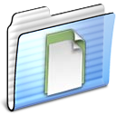
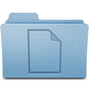
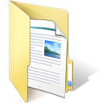
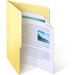

Icon themes are a bit harder to manage for us than regular app themes, so we spend less time working on them. Here's a list of what's available

| Mac OS 9 | Mac OS X | OS X 10.7 |
| --- | --- | --- |
|  |  |  |

| Windows 95 | Windows XP | Windows Longhorn |
| --- | --- | --- |
|  |  |  |

| Windows 7 | Windows 8 | Windows 10 |
| --- | --- | --- |
|  |  |  |
