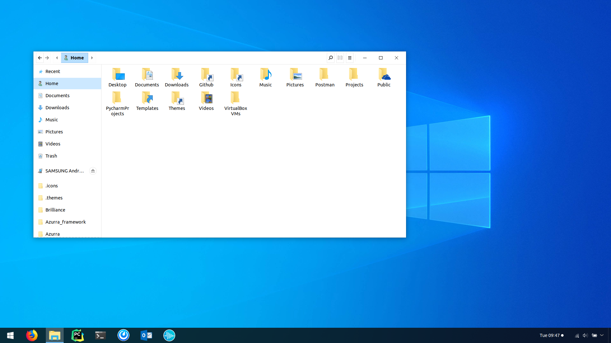
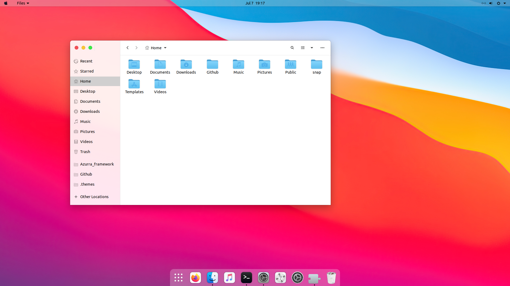
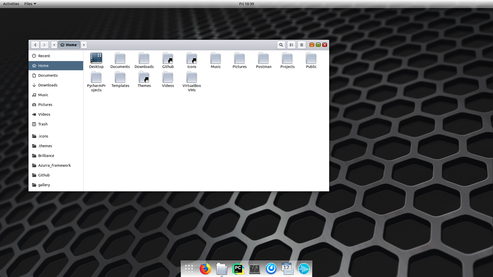
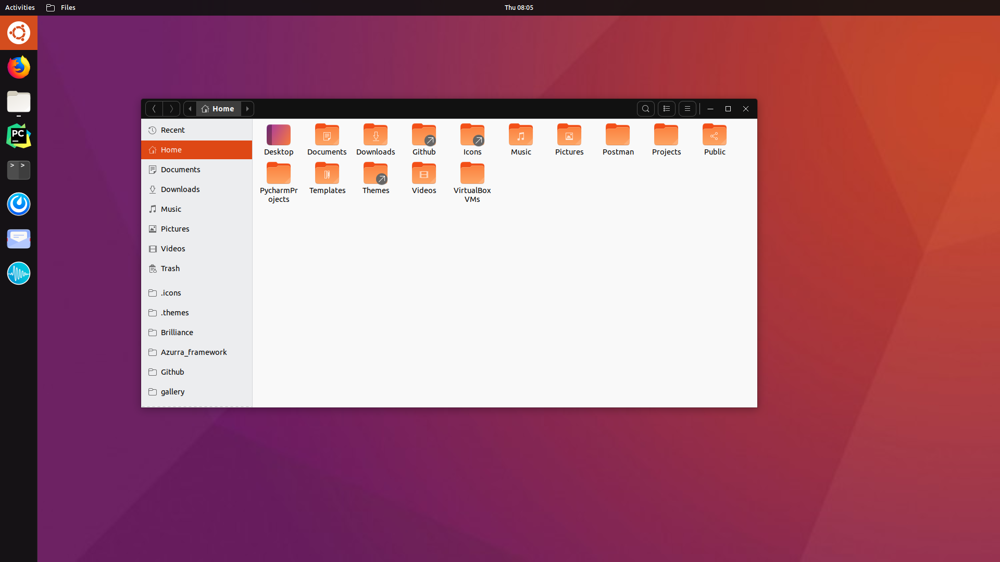
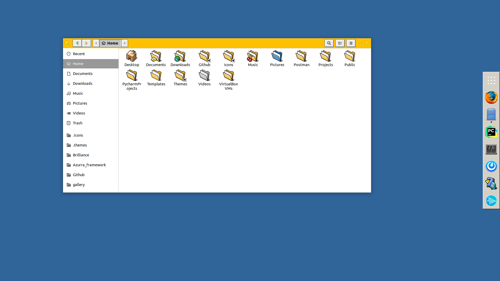

A portfolio of our themes inspired on the appearance of popular operating systems, both past and present.

#### Notice
> Some screenshots are old and may not reflect the current state of the theme

| [Windows](/windows) | [macOS/iOS](/macos) | [Android](/material) |
| --- | --- | --- |
|  |  |  |

| [Solaris](/solaris) | [Ubuntu](/solaris) | [Other](/other) |
| --- | --- | --- |
|  |  |  |
