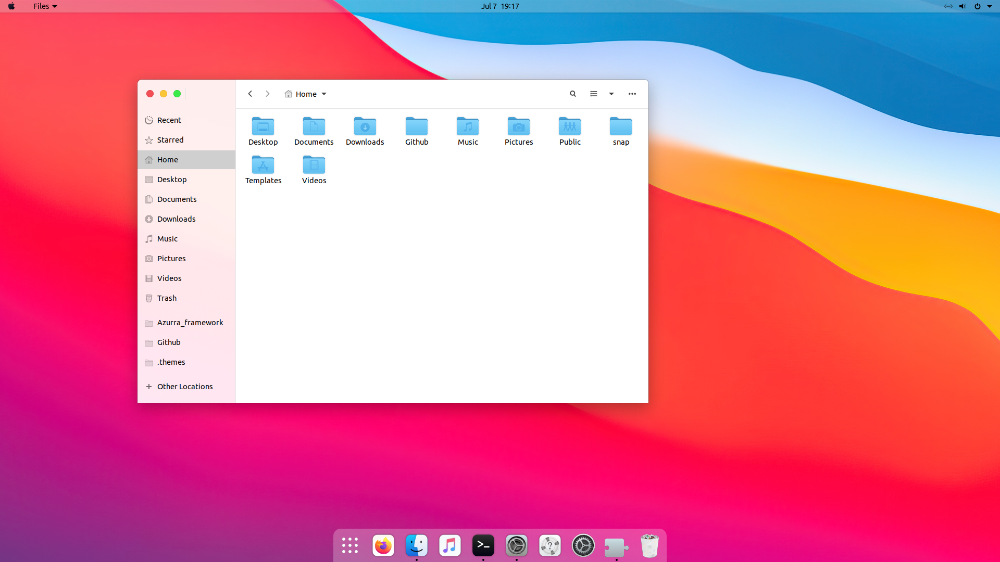

Apple's designs are probably the most memorable of those exposed in this site. Here's those we've managed to port so far:

### Before Mac OS 10
These systems were developed in-house at Apple, before the acquisition of NeXT

| [System 4](https://github.com/B00merang-Project/System-4) | [Mac OS 9](https://github.com/B00merang-Project/Mac-OS-9) |
| --- | --- |
|  |  |

### Aqua
This design marked the rebirth of the Mac OS

| [Mac OS X](https://github.com/B00merang-Project/Mac-OS-X-Cheetah) | [OS X Leopard](https://github.com/B00merang-Project/OS-X-Leopard) | [iOS 4](https://github.com/B00merang-Project/iOS-4) |
| --- | --- | --- |
|  |  |  |

### Skeumorphic
Remember the skeumorphic calendar app? We didn't port that.

| [OS X Mavericks](https://github.com/B00merang-Project/OS-X-Mavericks) | [iOS 6](https://github.com/B00merang-Project/iOS-6) |
| --- | --- |
|  |  |

### Flat
Out with the old, in with the new, flat, bright and colorful!

| [OS X Yosemite](https://github.com/B00merang-Project/OS-X-Yosemite) | [macOS Catalina](https://github.com/B00merang-Project/macOS-Catalina) | [macOS Catalina Dark](https://github.com/B00merang-Project/macOS-Catalina-Dark) |
| --- | --- | --- |
|  |  |  |

### Current
Apple's current designs rely on transparency to keep the design interesting. Unfortunately, it's difficult to recreate in GNOME and other DEs.

| [iOS](https://github.com/B00merang-Project/iOS) | [macOS](https://github.com/B00merang-Project/macOS) | [macOS Dark](https://github.com/B00merang-Project/macOS-Dark) |
| --- | --- | --- |
|  |  |  |
