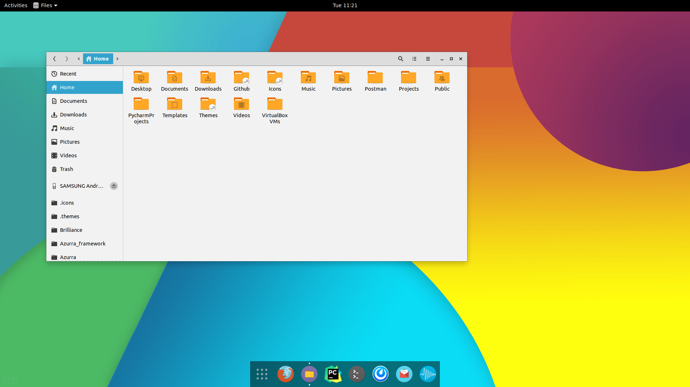
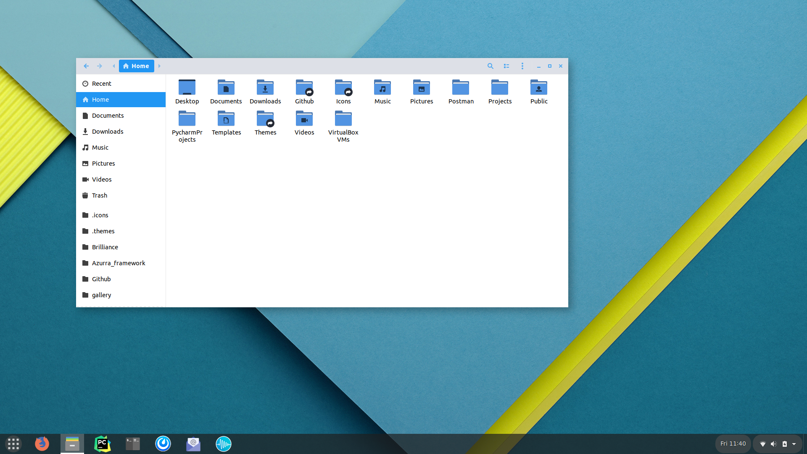
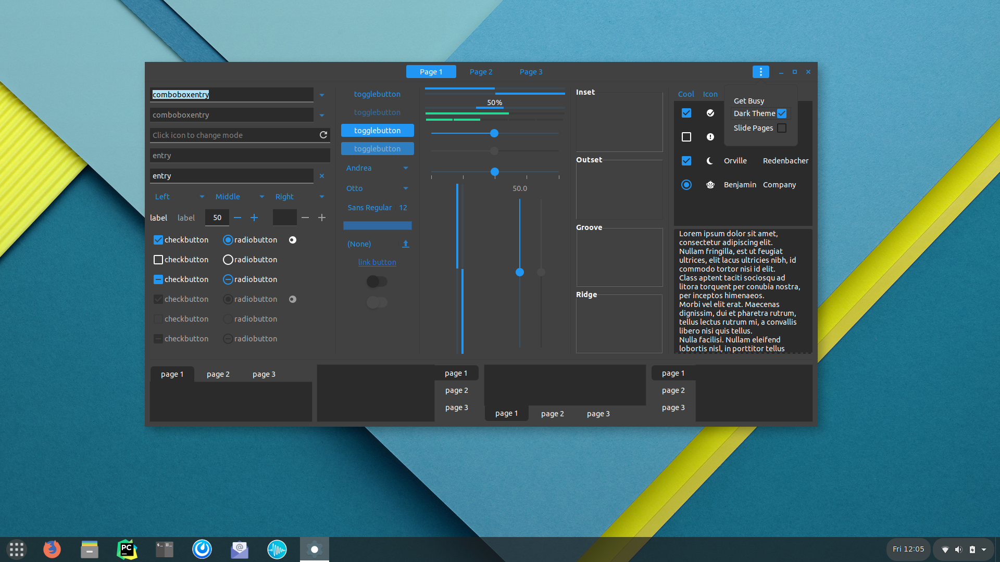
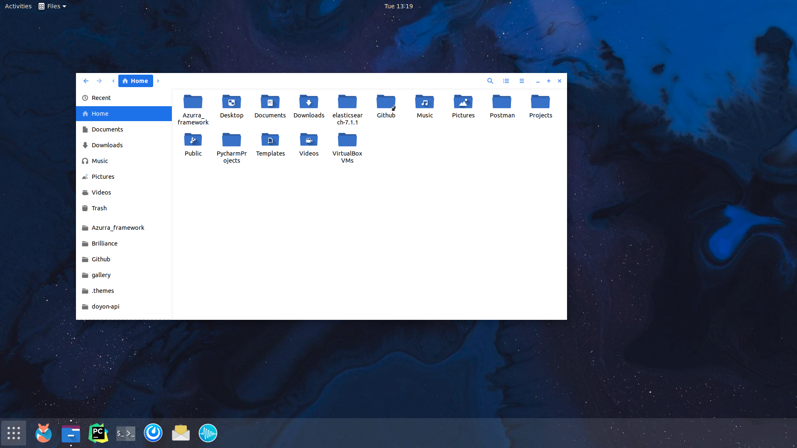
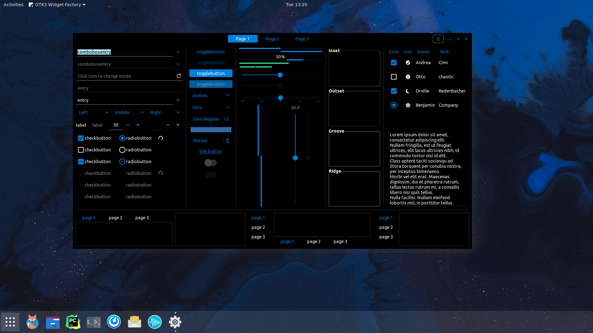

Most people are familiar with Material design, but not all Google designed used to be flat!

### Kitkat
The last iteration of the well-remembered Holo theme

| Kitkat | Kitkat dark |
| --- | --- |
|  |  |

### Material 2
Previously used on Android too, Material 2 has been slowly getting replaced by Material You

| Chrome OS | Chrome OS dark |
| --- | --- |
|  |  |

### Material You
Characterized by dynamic colors and generous padding, Material You brings Google's latest design to your desktop

| Android | Android dark |
| --- | --- |
|  |  |
