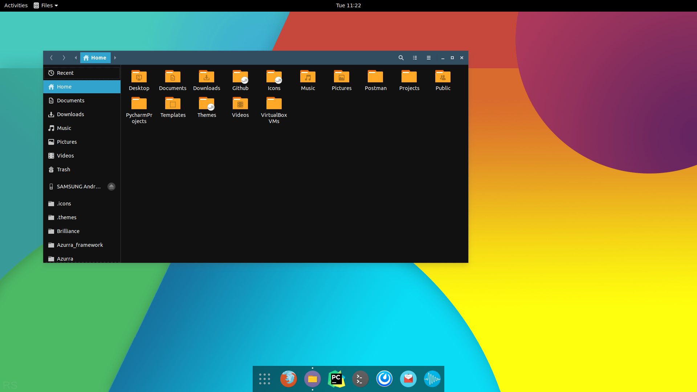

Most people are familiar with Material design, but not all Google designed used to be flat!

### Kitkat
The last iteration of the older Holo theme

| [Kitkat](https://github.com/B00merang-Project/Android-Kitkat) | [Kitkat dark](https://github.com/B00merang-Project/Android-Kitkat-Dark) |
| --- | --- |
|  |  |

### Material 2
Material 2 has been recently replaced by Material You, but remains in parts of Chrome OS

| [Chrome OS](https://github.com/B00merang-Project/Chrome-OS) | [Chrome OS dark](https://github.com/B00merang-Project/Chrome-OS) |
| --- | --- |
|  |  |

### Material You
Characterized by dynamic colors and generous padding, Material You brings Google's latest design to your desktop

| [Android](https://github.com/B00merang-Project/Android) | [Android dark](https://github.com/B00merang-Project/Android) |
| --- | --- |
|  |  |
