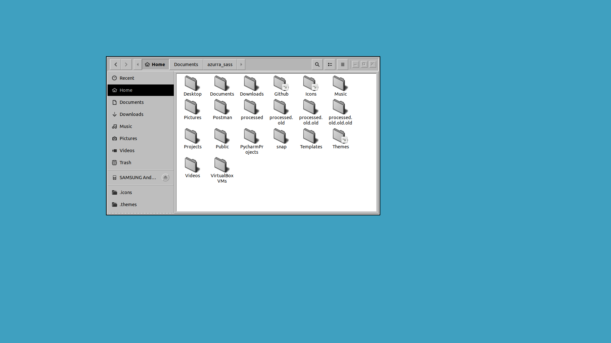
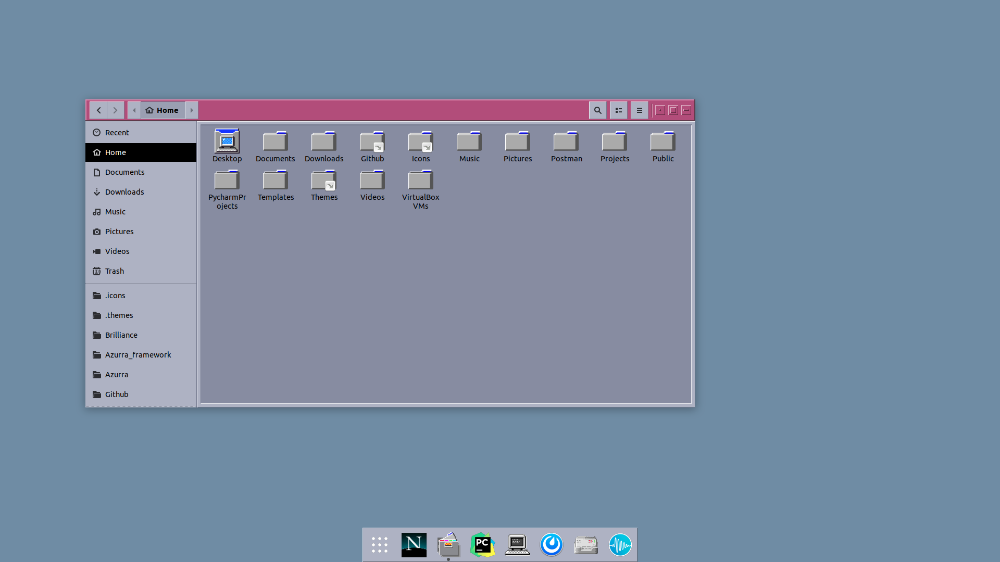
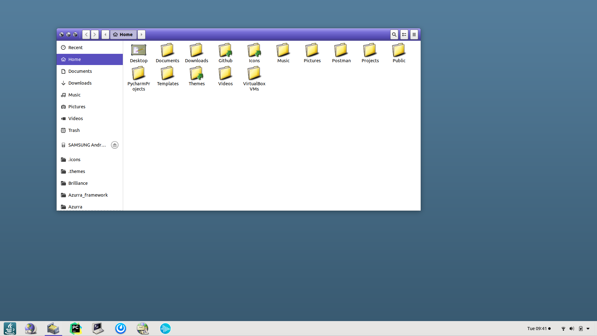
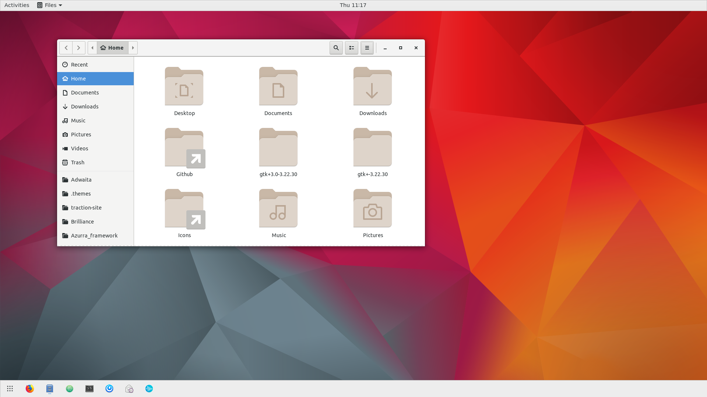

Solaris 

### Before Oracle
Solaris (previously SunOS) was the system that came with Sun's SPARC servers and was relatively successful

| [Solaris 8 (OLWM)](https://github.com/B00merang-Project/Solaris-8) | [Solaris 9 (CDE)](https://github.com/B00merang-Project/Solaris-9) | [Solaris 10 (JDE)](https://github.com/B00merang-Project/Solaris-10) |
| --- | --- | --- |
|  |  |  |

### After Oracle
Solaris 11 and the minor update it got that finally brought GTK3

| [Solaris 11](https://github.com/B00merang-Project/Solaris-11) | [Solaris 11.4](https://github.com/B00merang-Project/Adwaita) |
| --- | --- |
|  |  |
