The world's most popular (and least popular) OS, in most of it's variations!

### DOS-based
These versions were based on MS-DOS and look somewhat dated nowadays.

| Windows 2.0 | Windows 3.11 | Windows 95 |
| --- | --- | --- |
| 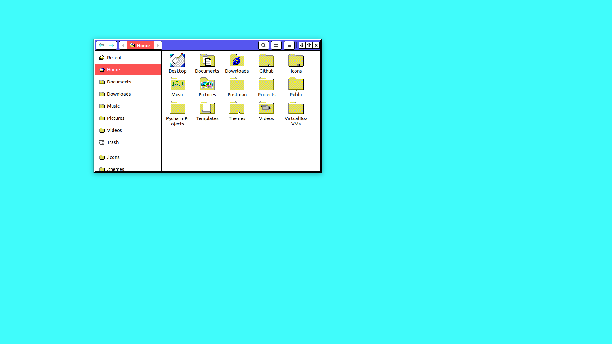 | 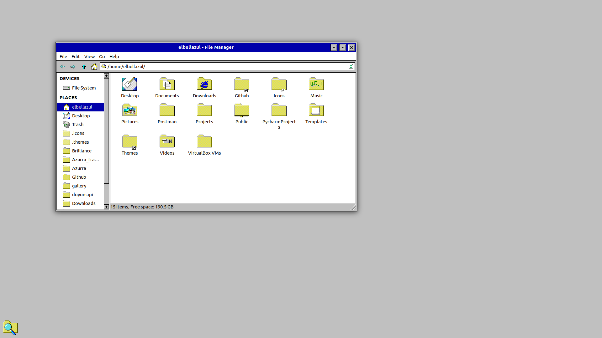 | 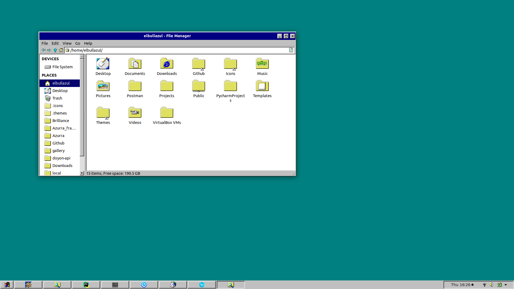 |

### Windows XP
The Fisher-Price design still looks good!

| Luna | Olive | Silver |
| --- | --- | --- |
|  |  |  |

| Royale | Royale Noir | Embedded | Zune |
| --- | --- | --- | --- |
| 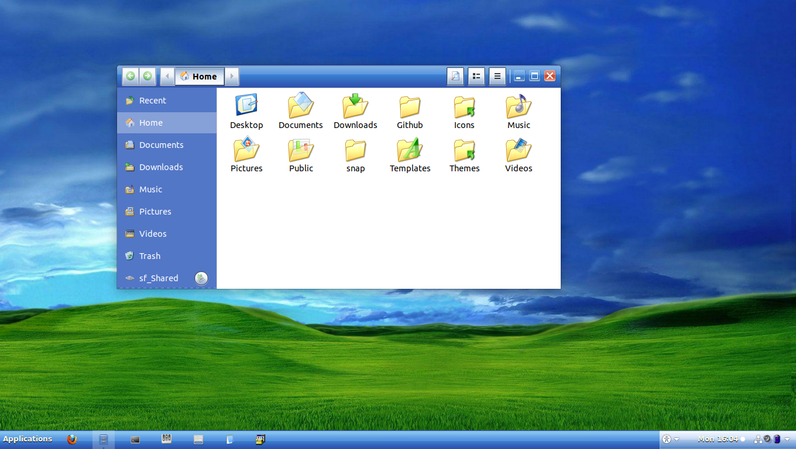 | 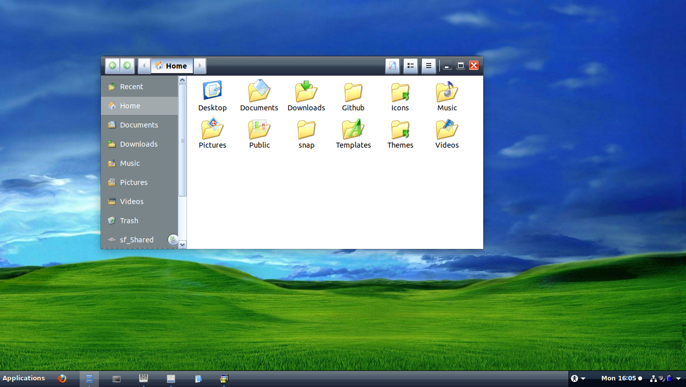 | 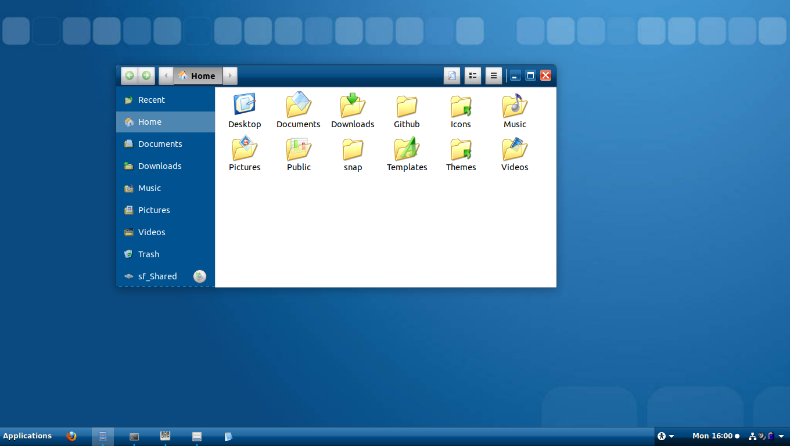 | 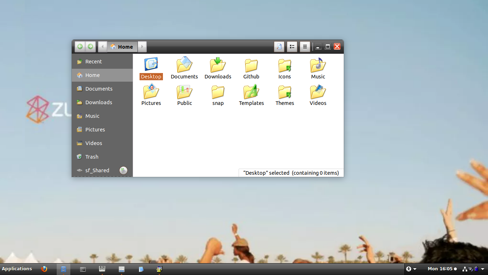 |

### Windows Longhorn
Longhorn was a series of developoment builds of what was to be XP's successor. After difficulties in development, Microsoft abandoned the project and restarted development based on Windows Server 2003

| Plex | Slate | Jade | Aero |
| --- | --- | --- | --- |
| 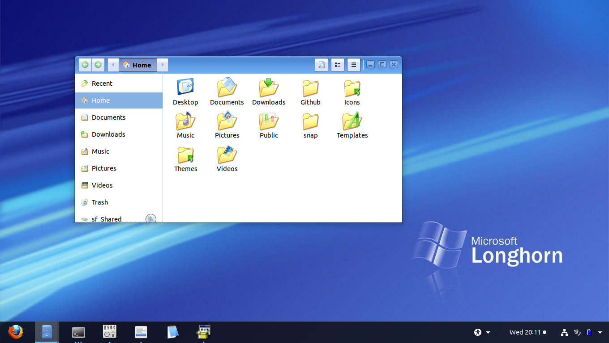 |  | 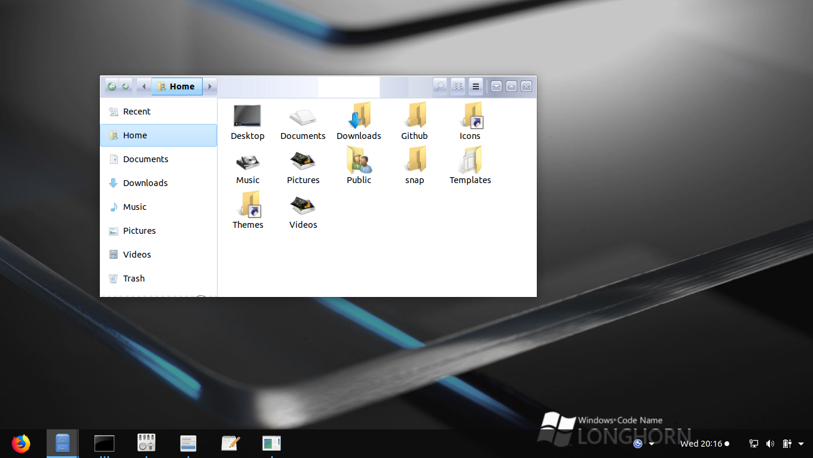 | 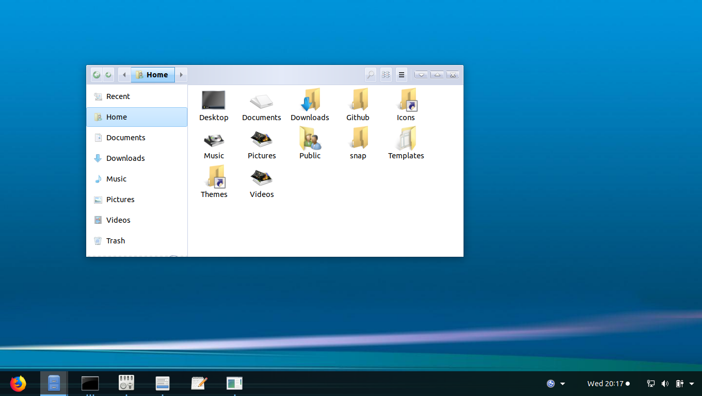 |

### Windows Aero
Late 2000s and early 2010s nostalgia

| Vista | 7 |
| --- | --- |
| 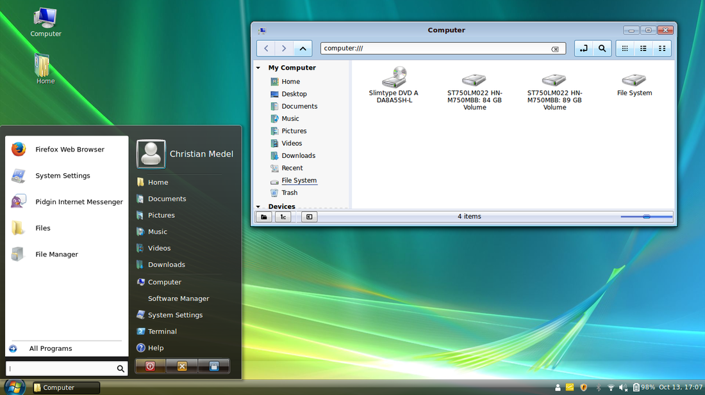 | 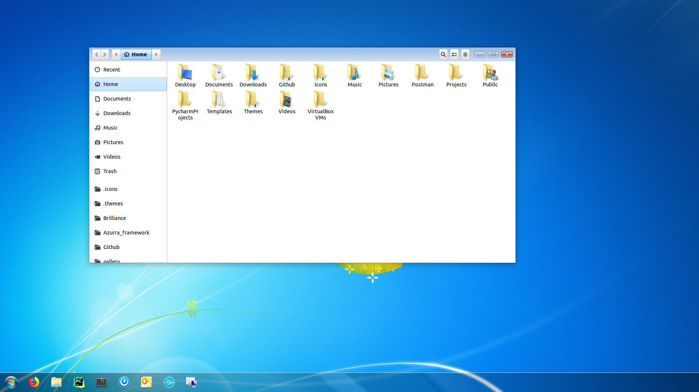 |

### Windows Modern
For these releases, Microsoft tried reinventing the wheel. It didn't go well

| 8 (Metro) | 8.1 |
| --- | --- |
| 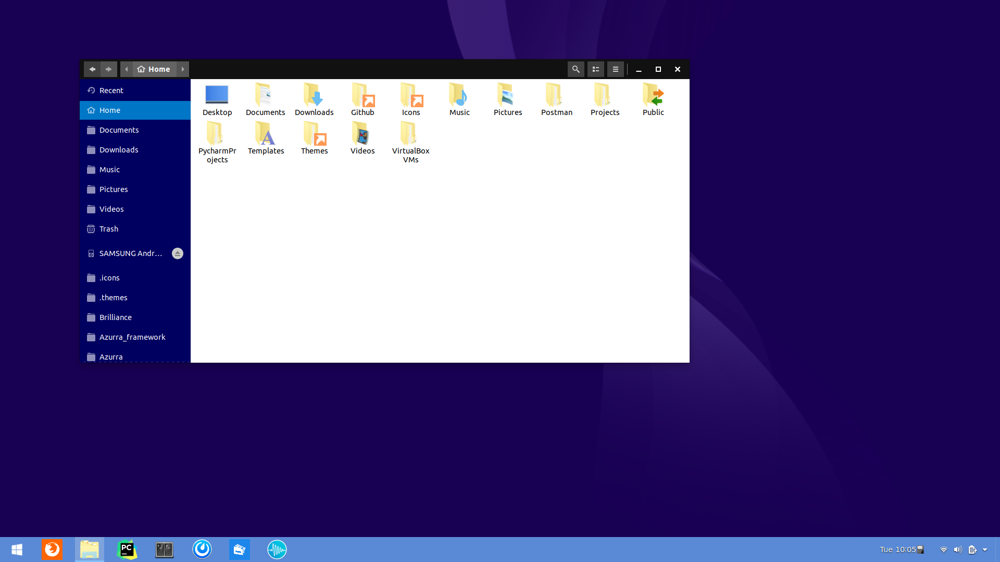 | 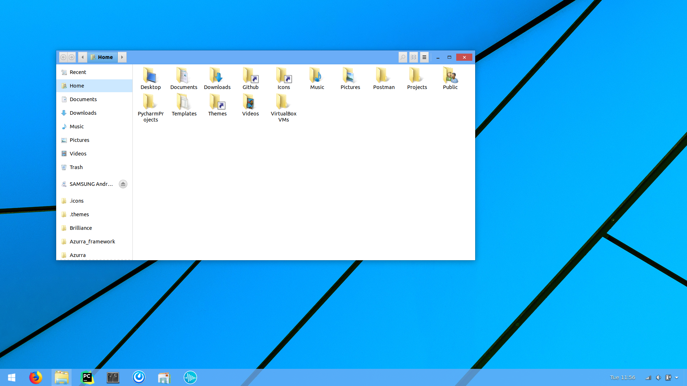 |

### Windows as a Service (WaaS)
The """last""" version of Windows (before Windows 11 came out)

| Windows 10 | Windows 10 Dark |
| --- | --- |
|  |  |

| Windows 10 X | Windows 10 X Dark |
| --- | --- |
| 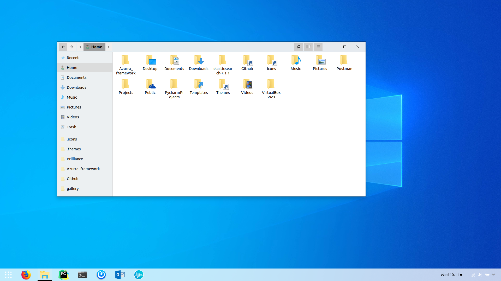 | 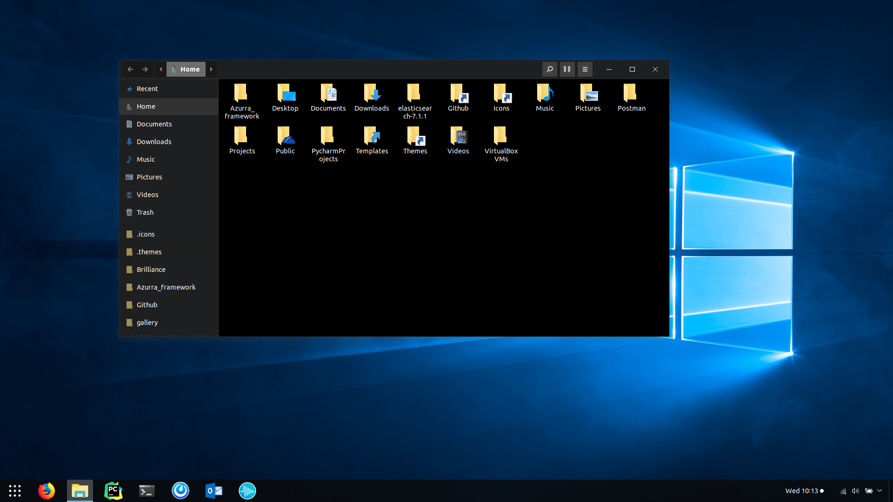 |

### Windows 11
The TRUE last version of Windows (ignore rumors about Windows 12 pls)

> coming soon...
