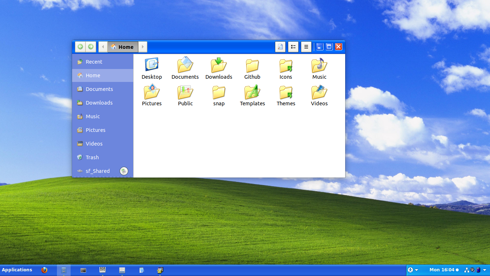
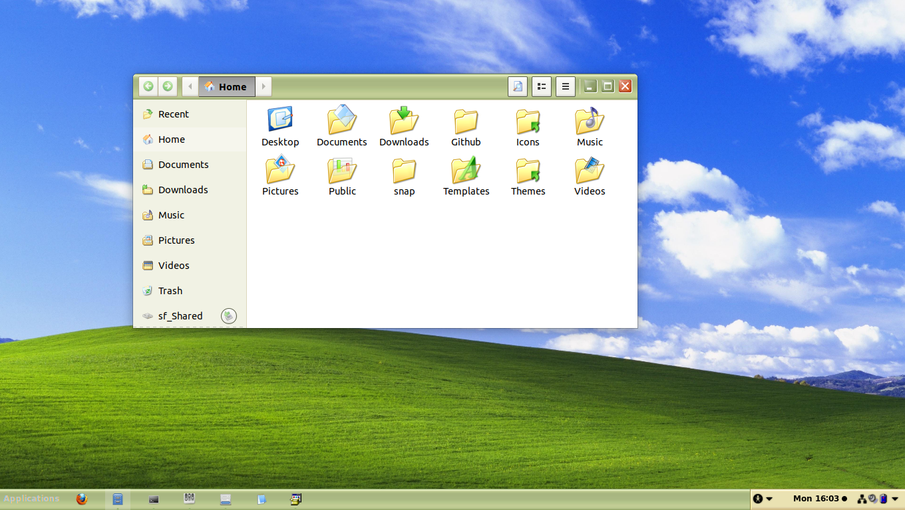
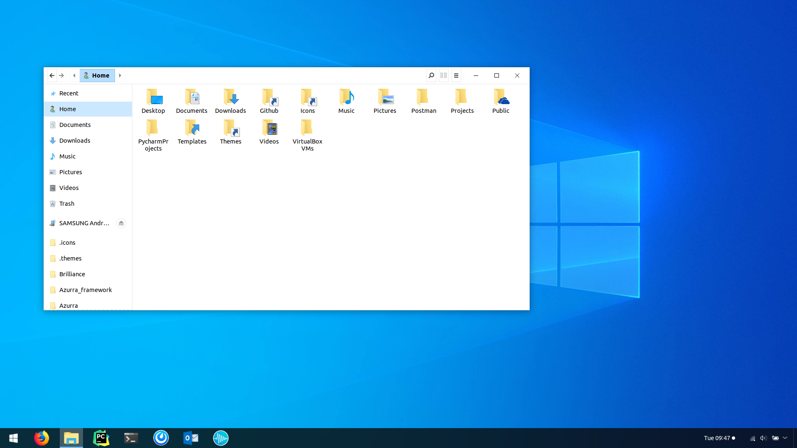
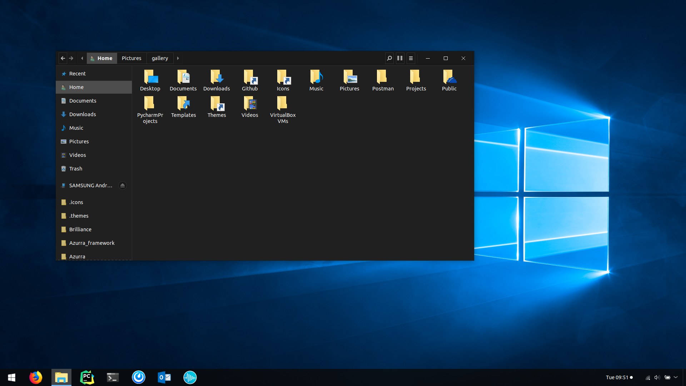

The world's most popular (and least popular) OS, in most of it's variations!

### DOS-based
These versions were based on MS-DOS and look somewhat dated, but remain classy.

| [Windows 2.0](https://github.com/B00merang-Project/Windows-2.0) | [Windows 3.11](https://github.com/B00merang-Project/Windows-3.11) | [Windows 95](https://github.com/B00merang-Project/) |
| --- | --- | --- |
|  |  |  |

### Windows XP
The Fisher-Price design still looks good!

| [Luna](https://github.com/B00merang-Project/Windows-XP) | [Olive](https://github.com/B00merang-Project/Windows-XP) | [Silver](https://github.com/B00merang-Project/Windows-XP) |
| --- | --- | --- |
|  |  |  |

| [Royale](https://github.com/B00merang-Project/Windows-XP) | [Royale Noir](https://github.com/B00merang-Project/Windows-XP) | [Embedded](https://github.com/B00merang-Project/Windows-XP) | [Zune](https://github.com/B00merang-Project/Windows-XP) |
| --- | --- | --- | --- |
|  |  |  |  |

### Windows Longhorn
Longhorn was a series of developoment builds of what was to be XP's successor. After difficulties in development, Microsoft abandoned the project and restarted development based on Windows Server 2003

| [Plex](https://github.com/B00merang-Project/Windows-Longhorn) | [Slate](https://github.com/B00merang-Project/Windows-Longhorn) | [Jade](https://github.com/B00merang-Project/Windows-Longhorn) | [Aero](https://github.com/B00merang-Project/Windows-Longhorn) |
| --- | --- | --- | --- |
|  |  |  |  |

### Windows Aero
Late 2000s and early 2010s nostalgia

| [Vista](https://github.com/B00merang-Project/Windows-Vista) | [7](https://github.com/B00merang-Project/Windows-7) |
| --- | --- |
|  |  |

### Windows Modern
For these releases, Microsoft tried reinventing the wheel. It didn't go well

| [8 (Metro)](https://github.com/B00merang-Project/Windows-8.1-Metro) | [8.1](https://github.com/B00merang-Project/Windows-8.1) |
| --- | --- |
|  |  |

### Windows as a Service (WaaS)
The """last""" version of Windows (before Windows 11 came out)

| [Windows 10](https://github.com/B00merang-Project/Windows-10) | [Windows 10 Dark](https://github.com/B00merang-Project/Windows-10-Dark) |
| --- | --- |
|  |  |

| [Windows 10 X](https://github.com/B00merang-Project/Windows-10-Fluent) | [Windows 10 X Dark](https://github.com/B00merang-Project/Windows-10-Fluent) |
| --- | --- |
|  |  |

### Windows 11
The TRUE last version of Windows (ignore rumors about Windows 12 pls)

> coming soon...
